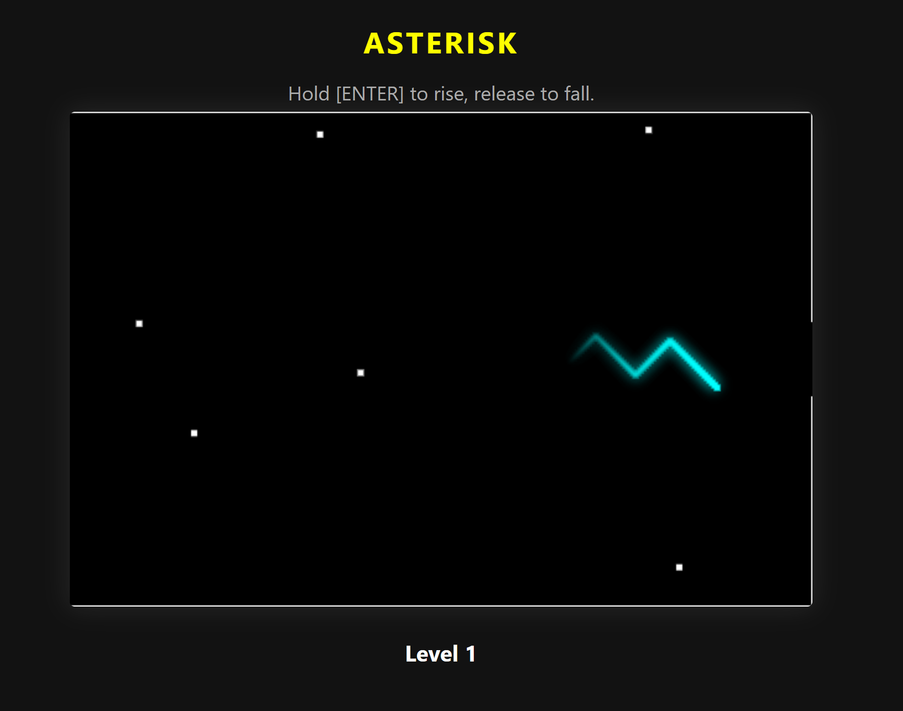

# Asterisk HTML5
> A modern, browser-based reinvention of the classic WinForms arcade game.

## Project Overview

**Asterisk HTML5** is a complete ground-up port of the classic C# 'Asterisk' WinForms game into a sleek, modern HTML5 Canvas experience. It preserves the original gap-dodging and physics-based climbing mechanics while drastically improving the visual presentation, input responsiveness, and codebase architecture.


*Visual demonstration of the neon-trail rendering engine in action.*

## Features

- **High-Performance Game Loop:** Utilizes a custom, frame-rate-independent engine powered by `requestAnimationFrame` and delta-time calculations for perfectly smooth scaling.
- **State-Driven Arcade Flow:** A robust, conflict-free state machine handles transitions smoothly from Color Select -> Ready to Launch -> Playing -> Crash/Reset.
- **AABB Collision Detection:** Replaces the legacy, expensive per-pixel color checking of the C# era with rapid, mathematical Axis-Aligned Bounding Box (AABB) collision checks.
- **Glowing Trail System:** A creative rendering technique that maps the player's historical position array to dynamic alpha-faded neon strokes for a highly polished visual finish.

## How to Run

Because this game relies entirely on native browser APIs with no external dependencies or build steps, running it is incredibly simple.

```bash
# 1. Clone the repository or download the source code
git clone https://github.com/AnirudhaSrinivas/asterisk.git

# 2. Open the directory
cd asterisk

# 3. Simply open index.html in your browser!
# On Windows, you can type:
start index.html
```
Alternatively, just double-click the `index.html` file in your file explorer to play immediately.

## Architectural Highlights

The original C# application utilized `WinForms` and tied game ticks to standard UI timers (`System.Windows.Forms.Timer`), which inherently suffers from UI-thread blocking and visually stuttering updates. 

By migrating to an **HTML5 Canvas architecture**, the rendering layer is completely decoupled from the DOM. This allowed for the implementation of a dedicated game loop that synchronizes directly with the monitor's refresh rate. Furthermore, the explicit finite state machine design (`STATE.COLOR_SELECT`, `STATE.START`, `STATE.PLAYING`) guarantees that menu navigation keys and gameplay physics keys will never cross over or conflict, resulting in a significantly more polished user experience.
